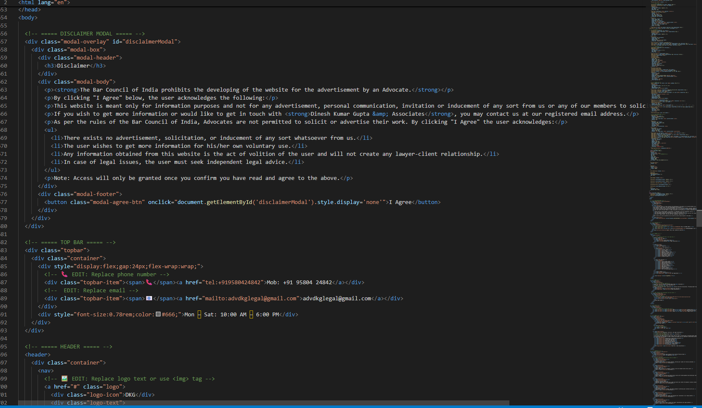
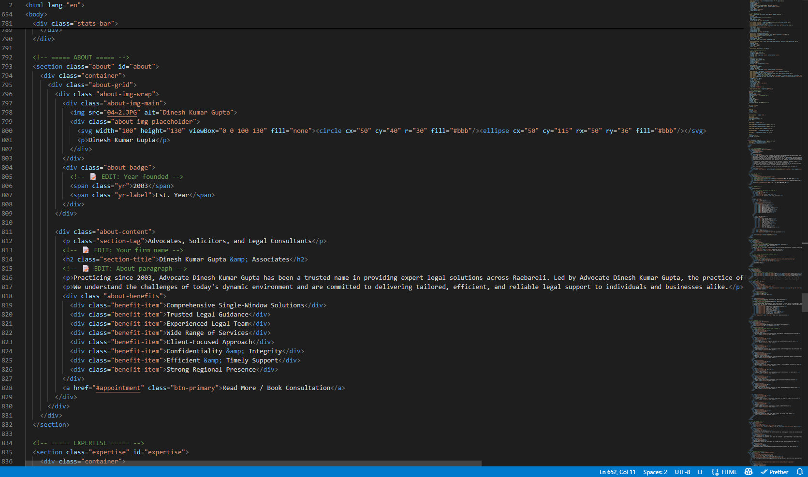
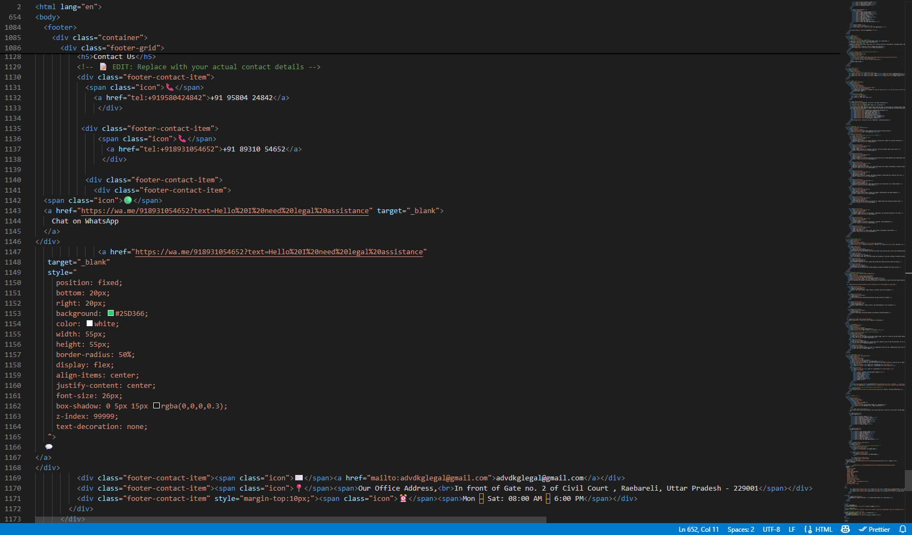

# ⚖️ Legal Services Website

A modern, responsive website developed for a legal professional to showcase legal services, practice areas, and contact information. The website was customized using AI-assisted development and further refined to meet client requirements.

## 🚀 Features

- Responsive design for desktop and mobile devices
- Professional landing page
- About section
- Practice areas and legal services
- Contact information
- Clean and user-friendly interface

## 🛠️ Technologies Used

- HTML5
- CSS3
- JavaScript
- Git
- GitHub

## 📂 Project Structure

```
legal-services-website/
│── index.html
│── style.css
│── script.js
│── assets/
│── images/
```
<h2>DISCLAIMER Page</h2>


<h2>About</h2>


<h2>Contact</h2>


## 🌐 Live Demo

https://manasgupta-ds.github.io/legal-services-website/

## 👨‍💻 Author

**Manas Gupta**

- GitHub: https://github.com/manasgupta-ds
- LinkedIn: https://www.linkedin.com/in/manasgupta-ds

## 📌 Note

This project was created using AI-assisted development and customized, tested, and managed using Git and GitHub.
